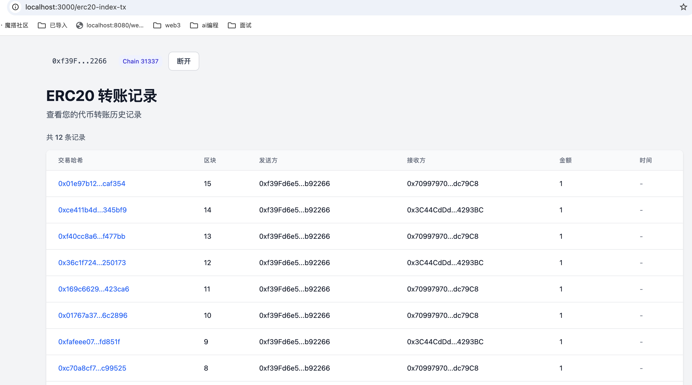

# ERC20 转账数据索引测试

本目录包含 ERC20 代币转账索引功能的测试工具。

## 功能概述

`transfer-tokens.sh` 脚本用于测试 ERC20 转账数据索引功能，它会：

1. 使用 `cast` 执行多笔代币转账交易
2. 将转账记录索引到 SQLite 数据库
3. 验证前后端数据一致性

## 测试效果



## 快速开始

```bash
cd viem-front

# 1. 确保 anvil 节点正在运行（另开终端）
anvil

# 2. 启动索引服务（另开终端）
node test/erc20-index-tx/start-indexer.cjs

# 3. 执行测试脚本（另开终端）
chmod +x test/erc20-index-tx/transfer-tokens.sh
./test/erc20-index-tx/transfer-tokens.sh
```

> 💡 **提示**: 索引服务会自动初始化数据库，无需手动执行 init-db.cjs

---

## 索引服务

### start-indexer.cjs — 事件索引服务

独立的 Node.js 服务，用于监听和索引 ERC20 Transfer 事件：

```bash
node test/erc20-index-tx/start-indexer.cjs
```

**功能特性**:
- ✅ 自动初始化数据库
- ✅ 监听 MyERC20 Transfer 事件
- ✅ 支持历史事件回放
- ✅ 自动记录索引进度
- ✅ 实时显示索引日志
- ✅ 优雅退出（Ctrl+C）

**输出示例**:
```
========================================
 ERC20 转账事件索引服务
========================================

配置信息:
  RPC URL:        http://127.0.0.1:8545
  Token Address:  0x51a1ceb8...
  Chain ID:       31337
  Poll Interval:  2000ms

索引起始区块: 0

✓ 启动事件监听...
✓ 索引服务运行中，按 Ctrl+C 停止

[18:45:23] Transfer #1: block=42 from=0xf39Fd6e5... to=0x70997970...
[18:45:25] Transfer #2: block=43 from=0xf39Fd6e5... to=0x3C44CdDd...
```

**配置参数**（环境变量）:

| 变量 | 默认值 | 说明 |
|------|--------|------|
| `RPC_URL` / `NEXT_PUBLIC_RPC_URL` | `http://127.0.0.1:8545` | RPC 端点 |
| `TOKEN_ADDRESS` / `NEXT_PUBLIC_TOKEN_ADDRESS` | `.env.local` 中的值 | MyERC20 合约地址 |
| `CHAIN_ID` / `NEXT_PUBLIC_CHAIN_ID` | `31337` | 链 ID |
| `FROM_BLOCK` | `0` | 起始区块（0 = 从创世块开始） |
| `POLLING_INTERVAL` | `2000` (ms) | 轮询间隔 |

**停止服务**:
按 `Ctrl+C` 会显示汇总信息并优雅退出：

```
========================================
 索引服务已停止
========================================
  运行时间:       120秒
  索引记录数:     5条
  最后索引区块:   47
```

---

## 数据库初始化

### init-db.cjs — 手动初始化数据库（可选）

如果需要手动初始化或重置数据库：

```bash
node test/erc20-index-tx/init-db.cjs
```

### 清空数据库

如需重新开始测试：

```bash
# 1. 停止索引服务（如果在运行）
#    按 Ctrl+C 停止

# 2. 删除数据库文件
rm viem-front/transfers.db

# 3. 重新启动索引服务
node test/erc20-index-tx/start-indexer.cjs
```

---

## 配置说明

### 配置来源

脚本会自动加载 `viem-front/.env.local`（与前端共用配置），优先级：

```
CLI 环境变量  >  .env.local  >  代码内默认值
```

### 配置参数

| 环境变量 | `.env.local` 键 | 默认值 | 说明 |
|---------|----------------|--------|------|
| `RPC_URL` | `NEXT_PUBLIC_RPC_URL` | `http://127.0.0.1:8545` | RPC 端点 |
| `TOKEN_ADDRESS` | `NEXT_PUBLIC_TOKEN_ADDRESS` | `.env.local` 中的值 | MyERC20 合约地址 |
| `SENDER_PRIVATE_KEY` | — | anvil 账户 #0 | 发送方私钥 |
| `SENDER_ADDRESS` | — | anvil 账户 #0 | 发送方地址 |
| `RECEIVER1_ADDRESS` | — | anvil 账户 #1 | 接收方 1 地址 |
| `RECEIVER2_ADDRESS` | — | anvil 账户 #2 | 接收方 2 地址 |
| `TRANSFER_COUNT` | — | `5` | 转账次数 |
| `AMOUNT_PER_TRANSFER` | — | `1000000000000000000` | 每笔转账金额 (wei) |

> ⚠️ 使用 anvil 默认私钥仅供本地测试，切勿用于主网。

## 测试流程

### 1. 前置检查

脚本启动时会检查：

- ✅ `cast` 命令是否已安装
- ✅ RPC 节点是否在线
- ✅ 合约地址是否有效

### 2. 查询初始状态

查询三个账户的初始代币余额：

- Sender (Account #0)
- Receiver1 (Account #1)
- Receiver2 (Account #2)

### 3. 执行转账

根据 `TRANSFER_COUNT` 配置执行相应数量的转账：

- 转账交替发送给 Receiver1 和 Receiver2
- 每笔转账使用相同的金额 `AMOUNT_PER_TRANSFER`
- 实时显示交易哈希和区块号

示例输出：

```
[1/5] 发送到 Receiver1: 0x70997970...dc79C8
  ✓ tx=0x221cf4fa...765da  block=42

[2/5] 发送到 Receiver2: 0x3C44CdDd...293BC
  ✓ tx=0x639c85a8...36b04  block=43
```

### 4. 查询最终状态

查询并对比转账前后的余额变化：

```
Sender:      1000000000000000000000000 -> 999995000000000000000000 (差值: 5000000000000000000)
Receiver1:   0 -> 3000000000000000000 (差值: 3000000000000000000)
Receiver2:   0 -> 2000000000000000000 (差值: 2000000000000000000)
```

### 5. 验证索引功能

完成转账后，通过以下方式验证数据已被正确索引：

#### 方法 1: 前端页面

访问 http://localhost:3000/erc20-index-tx，使用测试账户连接钱包查看转账记录。

#### 方法 2: 数据库查询

```bash
sqlite3 viem-front/transfers.db "SELECT * FROM transfers ORDER BY block_number DESC LIMIT 10;"
```

输出示例：

```
1|0x221cf4faebcbbb8bcf3ea7a435f8d78a76fc7151946f7e8aba5c8c188f0675da|42|0|0xf39Fd6e51aad88F6F4ce6aB8827279cffFb92266|0x70997970C51812dc3A010C7d01b50e0d17dc79C8|1000000000000000000||2026-07-28 10:30:45
```

#### 方法 3: API 接口

```bash
curl http://localhost:3000/api/transfers/0xf39Fd6e51aad88F6F4ce6aB8827279cffFb92266
```

响应示例：

```json
{
  "success": true,
  "data": {
    "transfers": [
      {
        "id": 1,
        "txHash": "0x221cf4fa...",
        "blockNumber": 42,
        "logIndex": 0,
        "fromAddress": "0xf39Fd6e5...",
        "toAddress": "0x70997970...",
        "value": "1000000000000000000",
        "timestamp": null,
        "createdAt": "2026-07-28T10:30:45Z"
      }
    ],
    "total": 5,
    "page": 1,
    "limit": 20
  }
}
```

## 高级用法

### 自定义转账参数

```bash
# 执行 10 笔转账，每笔 2 tokens
TRANSFER_COUNT=10 AMOUNT_PER_TRANSFER=2000000000000000000 \
  ./test/erc20-index-tx/transfer-tokens.sh
```

### 使用自定义账户

```bash
# 使用指定发送方和接收方
SENDER_PRIVATE_KEY=0x... \
SENDER_ADDRESS=0x... \
RECEIVER1_ADDRESS=0x... \
RECEIVER2_ADDRESS=0x... \
  ./test/erc20-index-tx/transfer-tokens.sh
```

### 连接远程 RPC

```bash
# 连接到 Sepolia 测试网
RPC_URL=https://sepolia.infura.io/v3/YOUR_KEY \
TOKEN_ADDRESS=0x... \
  ./test/erc20-index-tx/transfer-tokens.sh
```

> ⚠️ 在真实网络上测试时，请确保：
> 1. 账户有足够的 ETH 支付 gas
> 2. 账户有足够的代币余额
> 3. 使用真实的私钥，不要使用 anvil 默认私钥

## 数据验证

### 验证数据库记录

```bash
# 查询最新 10 条记录
sqlite3 viem-front/transfers.db \
  "SELECT
    id,
    substr(tx_hash, 1, 10) || '...' as tx,
    block_number as block,
    substr(from_address, 1, 10) || '...' as from,
    substr(to_address, 1, 10) || '...' as to,
    value
  FROM transfers
  ORDER BY block_number DESC
  LIMIT 10;"
```

### 验证余额一致性

```bash
# 查询某个地址的转账记录总数
sqlite3 viem-front/transfers.db \
  "SELECT COUNT(*) FROM transfers
   WHERE from_address = '0x...' OR to_address = '0x...';"
```

### 清空测试数据

```bash
# 删除数据库文件重新开始
rm viem-front/transfers.db
```

## 常见问题

### 1. 脚本执行失败: "未安装 cast 命令"

**原因**: Foundry 未安装

**解决**: 安装 Foundry
```bash
curl -L https://foundry.paradigm.xyz | bash
foundryup
```

### 2. 连接 RPC 失败

**原因**: anvil 节点未启动

**解决**: 另开终端启动 anvil
```bash
anvil
```

### 3. 前端页面无数据显示

**可能原因**:
- 索引服务未启动（检查 `npm run dev` 控制台日志）
- 数据库文件权限问题
- 钱包未连接

**排查步骤**:
1. 检查控制台是否有 "Starting ERC20 transfer indexing service..." 日志
2. 检查 `viem-front/transfers.db` 文件是否存在
3. 在前端连接钱包

### 4. 数据库查询为空

**可能原因**: 索引服务启动时间晚于转账发生时间

**解决**: 重启开发服务器，让索引服务重新回放历史事件
```bash
# 停止开发服务器 (Ctrl+C)
# 重新启动
npm run dev
```

## 相关文件

- **数据库模块**: `src/lib/database.ts`
- **索引服务**: `src/lib/erc20-indexer.ts`
- **API 接口**: `src/app/api/transfers/[address]/route.ts`
- **前端页面**: `src/app/erc20-index-tx/page.tsx`
- **展示组件**: `src/components/erc20-index-tx/TransfersTable.tsx`

## 扩展阅读

- [Viem Events 文档](https://viem.sh/docs/actions/public/watchEvent)
- [Foundry Cast 文档](https://book.getfoundry.sh/reference/cast/cast)
- [SQLite 命令行工具](https://www.sqlite.org/cli.html)