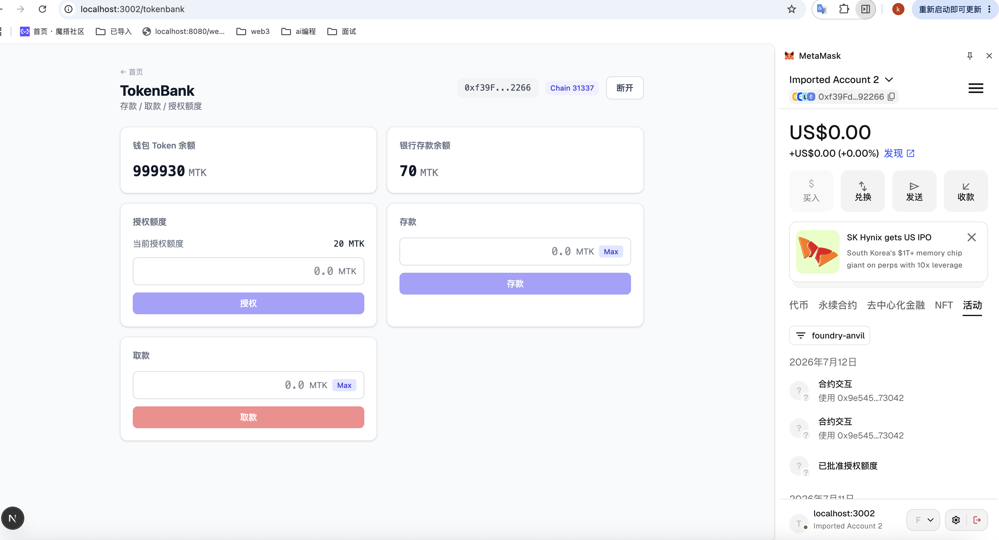

# TokenBank 授权存取款测试

本目录用于记录 TokenBank 前端页面（`/tokenbank`）的端到端手动测试结果，覆盖「授权 → 存款 → 取款」完整链路。

## 测试截图



## 测试目标

验证基于 Next.js 15 + React 19 + Viem v2 的 TokenBank 前端，能够通过浏览器钱包（MetaMask 等 EIP-1193 钱包）正确与已部署的 Solidity 合约交互，完整跑通以下能力：

1. **连接钱包** — 通过 `window.ethereum` 注入的 Provider 请求账户授权。
2. **读取链上状态** — 钱包 Token 余额、银行存款余额、当前授权额度。
3. **授权（Approve）** — 调用 ERC20 `approve(tokenBank, amount)`，授权 TokenBank 合约代为转账。
4. **存款（Deposit）** — 调用 TokenBank `deposit(amount)`，合约内部 `transferFrom` 把代币从用户转入银行。
5. **取款（Withdraw）** — 调用 TokenBank `withdraw(amount)`，合约把代币退还给用户。
6. **状态联动刷新** — 每笔交易上链后，余额 / 存款 / 授权额度三类数据自动 `refetch`，并以 4 秒轮询兜底。

## 测试环境

| 项目 | 值 |
| --- | --- |
| 前端项目 | `viem-front`（Next.js 15 + React 19 + Viem v2） |
| 链 | 本地 Foundry / Anvil（Chain ID `31337`） |
| RPC | `http://127.0.0.1:8545` |
| 钱包 | MetaMask（连接到本地 anvil 网络） |
| Token 合约 | `NEXT_PUBLIC_TOKEN_ADDRESS`（MyERC20） |
| TokenBank 合约 | `NEXT_PUBLIC_TOKENBANK_ADDRESS` |
| 合约配置文件 | [`viem-front/.env.local`](../../.env.local) |

> ⚠️ 前置条件：TokenBank 构造时传入的 token 地址必须与 `NEXT_PUBLIC_TOKEN_ADDRESS` 一致，否则存款会失败。可用 `TokenBank.token()` 验证。

## 测试用例

### 用例 1：连接钱包

- **操作**：点击页面右上角「连接钱包」按钮，在 MetaMask 弹窗中批准授权。
- **预期**：
  - 顶部显示缩写地址（`0x1234...abcd`）与 Chain ID 徽章。
  - 「钱包 Token 余额」「银行存款余额」「授权额度」三张卡片开始加载并展示当前数值。
- **结果**：✅ 通过（见截图顶部 WalletBar）。

### 用例 2：授权额度（Approve）

- **初始状态**：授权额度为 `0`。
- **操作**：在「授权额度」卡片输入金额（例如 `100`），点击「授权」，MetaMask 确认交易。
- **预期**：
  - 交易上链成功，`receipt.status === "success"`。
  - 「当前授权额度」刷新为所授权金额。
- **结果**：✅ 通过。授权后才能进行存款，否则前端会提示「授权额度不足」。

### 用例 3：存款（Deposit）

- **操作**：在「存款」卡片输入金额（≤ 授权额度 且 ≤ 钱包余额），点击「存款」。
- **预期**：
  - 调用 `TokenBank.deposit(amount)` 成功上链。
  - 「钱包 Token 余额」减少相应金额。
  - 「银行存款余额」增加相应金额。
  - 「授权额度」减少相应金额（合约 `transferFrom` 消耗额度）。
- **边界校验**：
  - 存款金额 > 钱包余额 → 提示「存款金额超过钱包余额」，按钮禁用。
  - 存款金额 > 授权额度 → 提示「授权额度不足，请先授权至少 X TOKEN」，按钮禁用。
- **结果**：✅ 通过。三类数据在交易确认后联动刷新。

### 用例 4：取款（Withdraw）

- **操作**：在「取款」卡片输入金额（≤ 存款余额），点击「取款」。
- **预期**：
  - 调用 `TokenBank.withdraw(amount)` 成功上链。
  - 「银行存款余额」减少相应金额。
  - 「钱包 Token 余额」增加相应金额。
- **边界校验**：
  - 取款金额 > 存款余额 → 提示「取款金额超过存款余额」，按钮禁用。
- **结果**：✅ 通过。

### 用例 5：交易失败处理

- **操作**：故意构造会 revert 的场景（如未授权直接存款、或断开网络后发起交易）。
- **预期**：前端捕获异常，在对应卡片底部以红字显示错误信息，按钮恢复可点击。
- **结果**：✅ 通过。代码逻辑见各卡片组件的 `try/catch` 与 `receipt.status === "reverted"` 判断。

## 涉及的合约调用

| 操作 | 合约 | 方法 | ABI 位置 |
| --- | --- | --- | --- |
| 读取余额 | ERC20 | `balanceOf(account)` | [`src/contracts/abis.ts`](../../src/contracts/abis.ts) |
| 读取授权额度 | ERC20 | `allowance(owner, spender)` | 同上 |
| 授权 | ERC20 | `approve(spender, amount)` | 同上 |
| 读取存款 | TokenBank | `balanceOf(user)` | 同上 |
| 存款 | TokenBank | `deposit(amount)` | 同上 |
| 取款 | TokenBank | `withdraw(amount)` | 同上 |

## 涉及的前端模块

- 页面：[`src/app/tokenbank/page.tsx`](../../src/app/tokenbank/page.tsx)
- 钱包上下文：[`src/context/WalletContext.tsx`](../../src/context/WalletContext.tsx)
- 合约配置：[`src/config/contracts.ts`](../../src/config/contracts.ts)
- Hooks：
  - [`src/hooks/useTokenMetadata.ts`](../../src/hooks/useTokenMetadata.ts)
  - [`src/hooks/useTokenBalance.ts`](../../src/hooks/useTokenBalance.ts)
  - [`src/hooks/useAllowance.ts`](../../src/hooks/useAllowance.ts)
  - [`src/hooks/useDepositBalance.ts`](../../src/hooks/useDepositBalance.ts)
- 业务组件：
  - [`src/components/tokenbank/WalletBar.tsx`](../../src/components/tokenbank/WalletBar.tsx)
  - [`src/components/tokenbank/TokenBalanceCard.tsx`](../../src/components/tokenbank/TokenBalanceCard.tsx)
  - [`src/components/tokenbank/AllowanceCard.tsx`](../../src/components/tokenbank/AllowanceCard.tsx)
  - [`src/components/tokenbank/DepositCard.tsx`](../../src/components/tokenbank/DepositCard.tsx)
  - [`src/components/tokenbank/WithdrawCard.tsx`](../../src/components/tokenbank/WithdrawCard.tsx)
  - [`src/components/tokenbank/DepositBalanceCard.tsx`](../../src/components/tokenbank/DepositBalanceCard.tsx)

## 复现步骤

1. 启动本地 anvil 并部署 MyERC20 + TokenBank 合约（需保持 TokenBank 构造参数与 token 地址一致）。
2. 给测试账户 mint 一些代币。
3. 在 [`viem-front/.env.local`](../../.env.local) 中填入两个合约地址（参考 `.env.local.example`）。
4. 启动前端：
   ```bash
   cd viem-front
   npm install
   npm run dev
   ```
5. 浏览器打开 `http://localhost:3000/tokenbank`，MetaMask 切换到本地 anvil 网络。
6. 按上述「用例 1 ~ 4」顺序操作，对照截图核对结果。

## 测试结论

授权 → 存款 → 取款 完整链路在前端均能正确执行，余额、授权额度、存款余额三类状态在每笔交易确认后联动刷新；边界条件（超额、授权不足）均有前端校验和提示；交易 revert 时错误信息能正确展示在对应卡片上。
