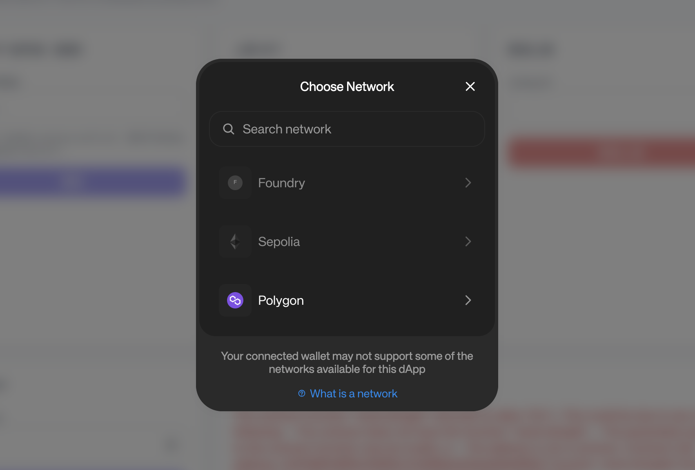
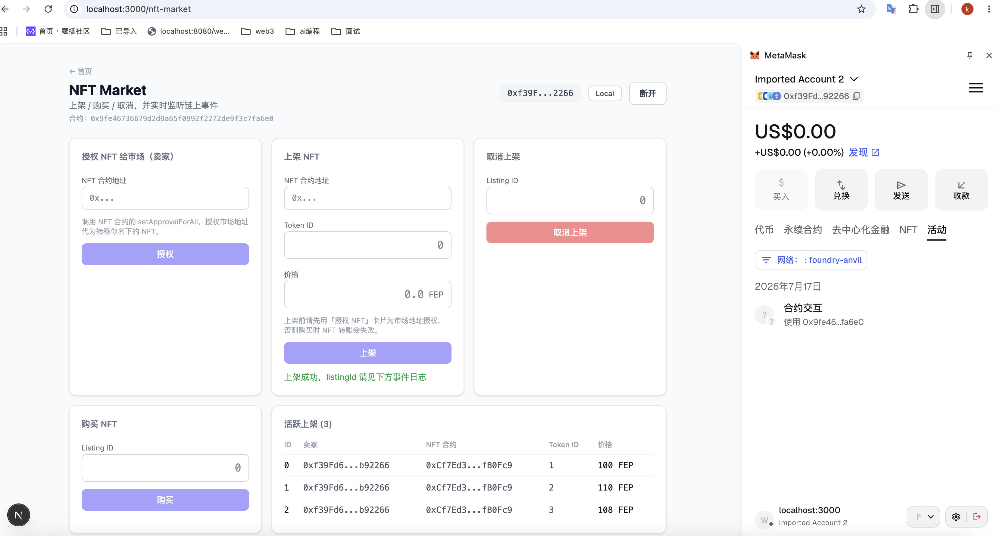

# NFT Market + AppKit 集成测试指南

本文档介绍如何在本地环境测试 NFT Market 合约与 Reown AppKit 钱包连接的集成。

## 前置要求

### 1. 安装依赖

确保已安装以下工具：

- **Node.js** (v18+)
- **pnpm** 或 **npm**
- **Foundry** (forge, cast) - 用于合约部署和交互
- **Anvil** - 本地测试链

安装 Foundry（如果尚未安装）：

```bash
curl -L https://foundry.paradigm.xyz | bash
foundryup
```

### 2. 获取 Reown Project ID

1. 访问 [Reown Cloud](https://cloud.reown.com/)
2. 创建新项目
3. 复制 Project ID

## 环境配置

### 1. 配置 .env.local

在 `wagmi-front` 目录下：

```bash
cp .env.local.example .env.local
```

编辑 `.env.local`，填入你的 Reown Project ID：

```bash
NEXT_PUBLIC_REOWN_PROJECT_ID=你的_project_id
```

### 2. 启动本地测试链

在项目根目录启动 Anvil：

```bash
anvil
```

Anvil 默认在 `http://127.0.0.1:8545` 启动，并提供了测试账户（账户 #0）：

- 地址: `0xf39Fd6e51aad88F6F4ce6aB8827279cffFb92266`
- 私钥: `0xac0974bec39a17e36ba4a6b4d238ff944bacb478cbed5efcae784d7bf4f2ff80`

### 3. 部署合约

运行部署脚本，一键部署所有合约：

```bash
cd wagmi-front
./scripts/deploy-contracts.sh
```

该脚本会部署以下合约：

1. **MyERC20** - 支付代币（ERC20）
2. **TokenBank** - 代币银行
3. **NFTMarket** - NFT 市场
4. **SimpleNft** - 测试用 NFT 合约（ERC721）

部署完成后，合约地址会自动写入 `.env.local` 文件。

## 启动前端

```bash
cd wagmi-front
npm install
npm run dev
```

访问 http://localhost:3000/nft-market

## 测试流程

### 1. 连接钱包

1. 打开 NFT Market 页面
2. 点击右上角 "Connect Wallet"
3. 选择钱包连接方式：
   - **WalletConnect** - 通过扫码连接移动端钱包
   - **Injected** - 连接浏览器插件钱包（如 MetaMask）

### 2. 切换网络

连接钱包后，确保切换到 **Foundry (31337)** 网络：



如果使用 WalletConnect 连接，需要在钱包 App 中切换网络。

### 3. 铸造测试 NFT

在测试上架功能前，需要先铸造一个 NFT：

```bash
# 使用默认 tokenId=1
./test/nftmarket-appkit/mint-nft.sh

# 或指定 tokenId
./test/nftmarket-appkit/mint-nft.sh 2
```

脚本会检查：
- SimpleNft 合约是否已部署
- Token ID 是否已被铸造
- 铸造成功后显示所有者地址

### 4. NFT 授权

在 NFT Market 页面：

1. 找到 "Approve NFT" 卡片
2. 输入要授权的 NFT Token ID（如 1）
3. 点击 "Approve"
4. 确认钱包交易

### 5. 上架 NFT



授权成功后：

1. 找到 "List NFT" 卡片
2. 输入：
   - **Token ID**: NFT 的 Token ID
   - **Price**: 上架价格（单位：MTK 代币）
3. 点击 "List"
4. 确认钱包交易

上架成功后，会在下方的 "Listings Table" 中看到新的上架记录。

### 6. 购买 NFT（使用另一个账户）

使用另一个测试账户（Anvil 账户 #1）：

- 地址: `0x70997970C51812dc3A010C7d01b50e0d17dc79C8`
- 私钥: `0x59c6995e998f97a5a0044966f0945389dc9e86dae88c7a8412f4603b6b78690d`

1. 切换到账户 #1
2. 确保账户 #1 有足够的 MTK 代币（需要先从账户 #0 转账）
3. 在 "Buy NFT" 卡片中输入上架 ID
4. 点击 "Buy"
5. 确认钱包交易

### 7. 取消上架

如果你想取消已上架的 NFT：

1. 在 "Cancel Listing" 卡片中输入上架 ID
2. 点击 "Cancel"
3. 确认钱包交易

### 8. 查看事件日志

页面底部的 "Event Logs" 卡片会实时显示链上事件：

- `Listed` - NFT 上架事件
- `Cancelled` - 取消上架事件
- `Purchased` - NFT 购买事件

每个事件会显示：
- 事件类型
- 上架 ID
- NFT 合约地址
- Token ID
- 卖家/买家地址
- 价格

## 常见问题

### 1. 钱包连接失败

确保：
- `.env.local` 中已配置 `NEXT_PUBLIC_REOWN_PROJECT_ID`
- 前端服务已重启（修改 .env.local 后需要重启）

### 2. 合约地址未配置

如果看到配置缺失提示：
- 检查 `.env.local` 中的合约地址
- 确保合约已部署：`./scripts/deploy-contracts.sh`
- 重启前端服务

### 3. Gas 不足

Anvil 测试账户默认有 10000 ETH，如果不够：

```bash
# 重启 Anvil 并自定义余额
anvil --balance 100000
```

### 4. NFT 已被铸造

如果看到 "Token ID 已被铸造" 错误，使用其他 Token ID：

```bash
./test/nftmarket-appkit/mint-nft.sh 2  # 使用 Token ID 2
```

## 测试检查清单

- [ ] Anvil 本地链已启动
- [ ] 合约已部署（4 个合约）
- [ ] .env.local 已配置 Reown Project ID
- [ ] 前端服务已启动
- [ ] 钱包已连接
- [ ] 网络已切换到 Foundry (31337)
- [ ] 测试 NFT 已铸造
- [ ] NFT 已授权给 Market 合约
- [ ] NFT 上架成功
- [ ] 事件日志正常显示

## 附录

### 合约地址（示例）

部署后的合约地址会写入 `.env.local`，示例：

```bash
NEXT_PUBLIC_TOKEN_ADDRESS_LOCAL=0x...
NEXT_PUBLIC_TOKENBANK_ADDRESS_LOCAL=0x...
NEXT_PUBLIC_NFT_MARKET_ADDRESS_LOCAL=0x...
NEXT_PUBLIC_SIMPLE_NFT_ADDRESS_LOCAL=0x...
```

### Anvil 默认账户

| 账户 | 地址 | 私钥 |
|------|------|------|
| #0 | `0xf39Fd6e51aad88F6F4ce6aB8827279cffFb92266` | `0xac0974bec39a17e36ba4a6b4d238ff944bacb478cbed5efcae784d7bf4f2ff80` |
| #1 | `0x70997970C51812dc3A010C7d01b50e0d17dc79C8` | `0x59c6995e998f97a5a0044966f0945389dc9e86dae88c7a8412f4603b6b78690d` |
| #2 | `0x3C44CdDdB6a900fa2b585dd299e03d12FA4293BC` | `0x5de4111afa1a4b94908f83103eb1f1706f76678a79d1c9b3d8b6b3c7e7a0b5e1` |

**注意**: 这些私钥仅用于本地测试，切勿在主网使用！